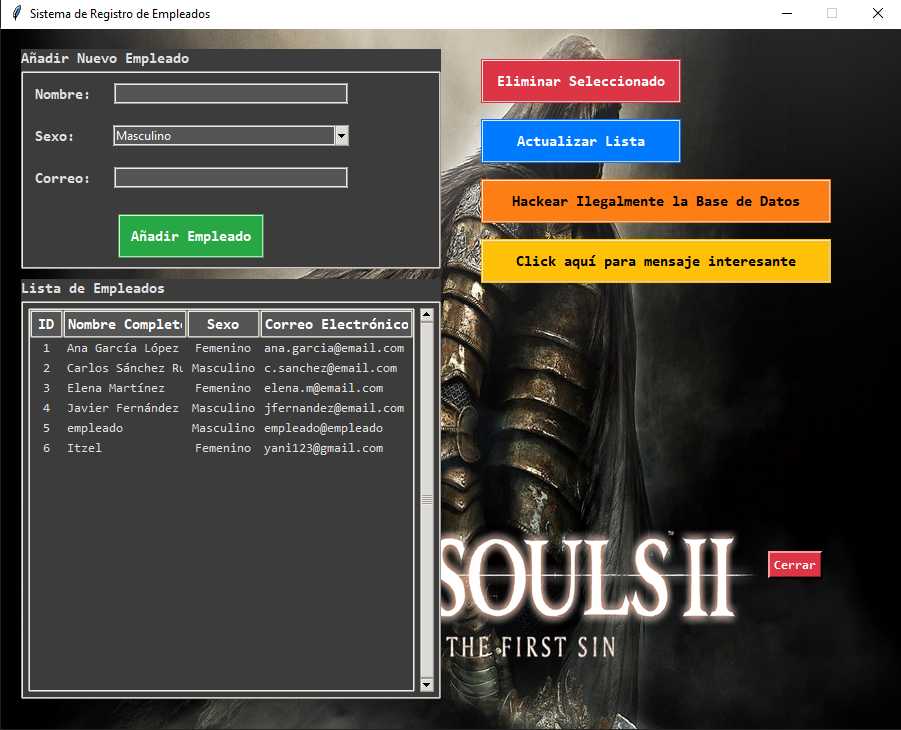

# Sistema de Registro de Empleados con Tkinter y MySQL

## Descripción
Este proyecto es una aplicación de escritorio para la gestión de empleados construida con Python usando la biblioteca gráfica Tkinter y una base de datos MySQL para el almacenamiento persistente. Permite agregar, eliminar y visualizar empleados a través de una interfaz amigable, incorporando seguridad en las consultas SQL y gestión robusta de conexión a la base de datos.

---

## Características principales
- Interfaz gráfica intuitiva y moderna con Tkinter y estilos personalizados (ttk).
- Conexión persistente con base de datos MySQL usando `mysql-connector-python`.
- Prevención de inyección SQL mediante consultas parametrizadas.
- Funciones CRUD básicas: agregar y eliminar empleados, además de mostrar la lista completa.
- Exportación "simulada" a CSV de la base de datos para respaldo o prueba.
- Manejo de errores y reconexión automática a la base de datos en caso de desconexión.
- Fondo con imagen y animación GIF en ventana emergente para interacción adicional.
- Botón "Cerrar" móvil como elemento divertido en la interfaz.

---

## Requisitos previos
- Python 3.x instalado en el sistema.
- MySQL instalado y configurado con la base de datos y tabla adecuadas.
- Librerías de Python necesarias:
  - `tkinter` (generalmente incluido con Python)
  - `mysql-connector-python`
  - `Pillow` (para manipulación de imágenes)
  
Puedes instalarlas usando pip:

```
pip install mysql-connector-python Pillow

```


---

## Configuración base de datos

Antes de ejecutar la aplicación, crea la base de datos y la tabla en MySQL con estos comandos:


---

## Configuración base de datos

Antes de ejecutar la aplicación, crea la base de datos y la tabla en MySQL con estos comandos:


```
CREATE DATABASE empresa_db;

USE empresa_db;

CREATE TABLE empleados (
id INT AUTO_INCREMENT PRIMARY KEY,
nombre VARCHAR(255) NOT NULL,
sexo VARCHAR(50),
correo VARCHAR(255) NOT NULL
);
```


Configura tu usuario y contraseña MySQL correctamente en el bloque de configuración dentro del archivo Python:

```
db_config = {
"host": "127.0.0.1",
"user": "root",
"password": "tu_contraseña_aqui",
"database": "empresa_db"
}


```


---

## Estructura del código

### Clase `EmpleadoModel`
- Maneja toda la lógica de conexión y comunicación con la base de datos.
- Realiza conexión persistente y supervisa su estado para reconexiones automáticas.
- Provee métodos para obtener empleados, agregar nuevos y eliminar por ID con seguridad SQL.

### Clase `App`
- Construye la interfaz gráfica usando Tkinter y ttk con un diseño organizado en frames.
- Carga la imagen de fondo y gestiona rutas de recursos mediante rutas absolutas.
- Define estilos personalizados para botones, etiquetas, entradas, combobox y tabla (Treeview).
- Provee funcionalidades para:
  - Añadir empleado desde formulario validando campos.
  - Mostrar empleados en un listado con scrollbar.
  - Eliminar empleado seleccionado con confirmación.
  - Actualizar lista de empleados.
  - Exportar datos a CSV ("hackeo ilegal" jocoso).
  - Mostrar ventana emergente con GIF animado.
  - Botón móvil "Cerrar" para salir con confirmación y cerrar conexión.
  
---

## Uso

1. Asegúrate de que la base de datos esté activa y configurada.
2. Coloca el archivo de fondo `darksouls.PNG` y el GIF `saludo_animado.gif` en el mismo directorio que el script.
3. Ajusta la configuración `db_config` con tus credenciales MySQL.
4. Ejecuta el script con Python:

```
python nombre_del_script.py

```


5. Usa la interfaz para agregar, eliminar o actualizar empleados.
6. Haz clic en "Hackear Ilegalmente la Base de Datos" para exportar la información a un CSV en la carpeta del script.
7. Explora la ventana del GIF con el botón de mensaje interactivo.

---

## Manejo de errores y seguridad
- La conexión a la base de datos se verifica antes de cada operación; si se pierde, intenta reconectar y notifica al usuario.
- Las consultas usan parámetros para evitar inyección SQL.
- Mensajes de error claros y cuadros de diálogo informativos en la interfaz.
- Comprobación de campos obligatorios para evitar errores de ingreso.

---

## Dependencias y versiones probadas
- Python 3.10 o superior
- MySQL Server 8.x o compatible
- mysql-connector-python 8.x
- Pillow 9.x

---

# Comparación entre dos códigos de interfaz gráfica para gestión de empleados

| Aspecto                         | Código Complejo                                                                                             | Código Simple                                                                                             |
|--------------------------------|-----------------------------------------------------------------------------------------------------------|----------------------------------------------------------------------------------------------------------|
| **Gestión de conexión BD**     | Mantiene conexión abierta mientras la app está en ejecución, con comprobación y reconexión automática.    | Conecta y desconecta en cada operación (abrir y cerrar conexión por método).                              |
| **Manejo conexión**             | Reconexión automática y verificación con `ping` para mantener activa la conexión.                         | Sin reconexión automática, sólo conexión y desconexión simple en cada método.                            |
| **Interfaz gráfica**            | Ventana fija (900x700), con imagen de fondo, estilos ttk personalizados (tema oscuro), y GIF animado.     | Ventana más pequeña (700x500), sin imagen de fondo ni animación, estilos ttk por defecto.                |
| **Widgets y diseño**            | Uso avanzado de frames, estilos personalizados para botones, combinaciones visuales y efectos en botones.| Diseño sencillo, organizado con `pack()`, botones con estilo estándar, sin efectos visuales complejos.  |
| **Funcionalidades extra**       | Exporta datos a CSV (broma), botón "Cerrar" móvil, ventana emergente con GIF, manejo detallado de errores. | Solo funcionalidades básicas: agregar, eliminar, actualizar lista. Sin exportación ni elementos extra.  |
| **Seguridad SQL**               | Usa consultas parametrizadas para prevenir inyección SQL en todos los métodos.                          | Igualmente usa consultas parametrizadas para prevenir inyección SQL.                                    |
| **Validación datos**            | Valida campos obligatorios (nombre y correo) antes de insertar.                                          | Igual validación básica para nombre y correo antes de insertar.                                         |
| **Manejo de errores BD**        | Mensajes específicos para error de conexión, consulta y reconexión.                                      | Mensajes similares pero sin reconexión automática ni manejo avanzado.                                   |
| **Organización código**         | Modelo y Vista/Controlador claramente separados, con métodos para reconexión y cierre final.              | Separación similar pero más simple, sin métodos especiales de reconexión o cierre final.                |
| **Manejo de eventos**           | Uso de bindings para eventos especiales, como botón cerrar móvil.                                        | Solo comandos simples en botones, sin eventos o animaciones adicionales.                                |
| **Recursos externos**           | Usa imágenes de fondo y GIF animado cargados desde rutas absolutas con manejo seguro.                     | No usa imágenes ni recursos externos.                                                                   |
---
### Fondo utilizado


## Imágenes comparativas
### Interfaz 1
#### 

### Interfaz 2



---
**Resumen:**  
El código complejo está diseñado para mayor robustez, funcionalidad visual y experiencia de usuario avanzada, mientras que el código simple se enfoca en cubrir las funciones básicas de gestión de empleados con un diseño minimalista y ejecución sencilla.


---

## Créditos
Desarrollado como ejemplo completo de integración GUI-Base de Datos en Python con Tkinter y MySQL. Inspirado en buenas prácticas de programación, manejo de excepciones y canales visuales para interacción con el usuario.

---

## Licencia
Este proyecto es libre para uso educativo y con fines de aprendizaje.

---
