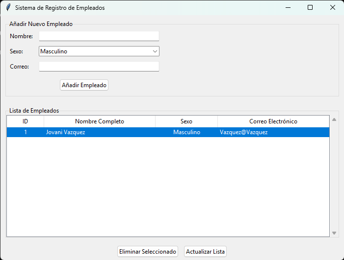

# Sistema de Registro de Empleados (Interfaz Gráfica)

**Autor:** [Enriqueso300](https://github.com/Enriqueso300)  
**Repositorio:** [Interfaz-Grafica](https://github.com/Enriqueso300/Interfaz-Grafica)

---

##  Descripción del Proyecto

Este proyecto implementa un **Sistema de Registro de Empleados** con una **interfaz gráfica desarrollada en Tkinter (Python)**.  
Permite realizar operaciones básicas de gestión sobre una base de datos MySQL: **agregar, visualizar y eliminar empleados**, manteniendo una comunicación segura y estructurada entre la aplicación y la base de datos.

La aplicación fue desarrollada siguiendo el patrón de diseño **Modelo–Vista–Controlador (MVC)**:
- **Modelo (`EmpleadoModel`)**: Maneja la lógica de negocio y la conexión a la base de datos.
- **Vista/Controlador (`App`)**: Administra la interfaz gráfica y las interacciones del usuario.

---

##  Imagen de la Interfaz gráfica



> La imagen anterior se encuentra dentro de la carpeta `Captura/` del repositorio.

---

##  Mejoras Respecto al Proyecto Original

El proyecto original funcionaba únicamente mediante **interfaz de línea de comandos (CLI)**.  
Esta nueva versión introduce mejoras significativas tanto en **usabilidad** como en **arquitectura de código**:

| Aspecto | Versión Anterior (CLI) | Nueva Versión (Interfaz Gráfica) |
|----------|------------------------|----------------------------------|
| **Interfaz** | Basada en texto (menús en consola). | GUI con `Tkinter` y `ttk` para una experiencia visual moderna. |
| **Arquitectura** | Procedimental, sin separación clara de responsabilidades. | Basada en clases (Modelo–Vista–Controlador). |
| **Conexión a BD** | Conexión directa sin encapsulación. | Clase `EmpleadoModel` con métodos seguros y reutilizables. |
| **Consultas SQL** | Potencialmente vulnerables. | Consultas parametrizadas → Prevención de **inyección SQL**. |
| **Errores y validaciones** | Mensajes simples por consola. | Mensajes gráficos (`messagebox`) con advertencias y confirmaciones. |


---

##  Requisitos del Sistema

###  Dependencias

Antes de ejecutar la aplicación, asegúrate de tener instaladas las siguientes herramientas:

- **Python 3.8+**
- **MySQL Server**
- **Conector de Python para MySQL**
  
Instala el conector con el siguiente comando:

```bash
pip install mysql-connector-python
```

---

##  Configuración de la Base de Datos

Crea una base de datos llamada `empresa_db` y una tabla `empleados` ejecutando las siguientes sentencias en tu cliente MySQL:

```sql
CREATE DATABASE empresa_db;

USE empresa_db;

CREATE TABLE empleados (
    id INT AUTO_INCREMENT PRIMARY KEY,
    nombre VARCHAR(100) NOT NULL,
    sexo ENUM('Masculino', 'Femenino', 'Otro') NOT NULL,
    correo VARCHAR(100) NOT NULL
);
```

> Puedes modificar los valores de conexión en el archivo principal (`main.py`) dentro del diccionario `db_config`.

Ejemplo:
```python
db_config = {
    "host": "127.0.0.1",
    "user": "root",
    "password": "toor",
    "database": "empresa_db"
}
```

---

##  Ejecución del Programa

Clona el repositorio y ejecuta el archivo principal:

```bash
git clone https://github.com/Enriqueso300/Interfaz-Grafica.git
cd Interfaz-Grafica
python main.py
```

La aplicación abrirá una ventana donde podrás:
- Registrar nuevos empleados  
- Consultar la lista completa  
- Eliminar empleados seleccionados  
- Actualizar la vista con un clic  

---


 


**Desarrollado con Python y Tkinter — por [Enriqueso300](https://github.com/Enriqueso300)**

